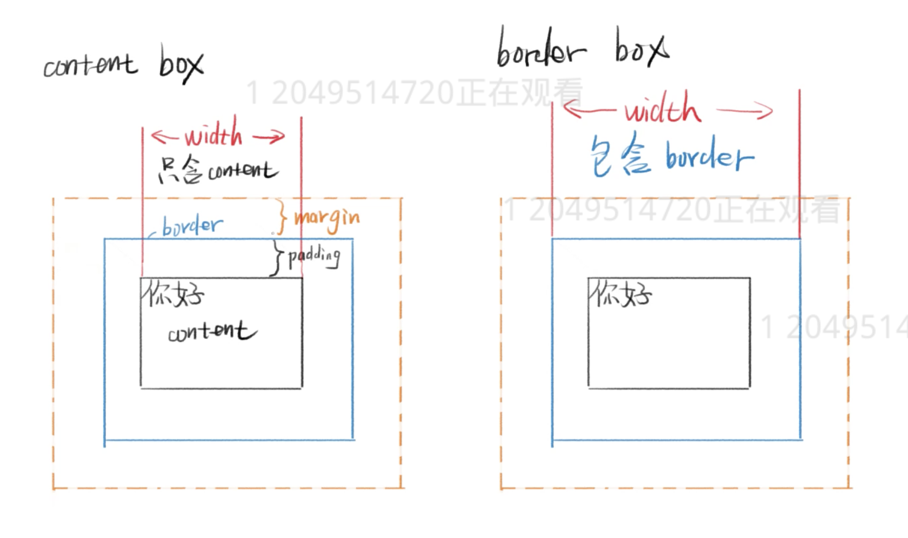

# 001 HTML Practice
### shortcut to create the ul list
1. select  many lines
2. in the vscode，press 'command +shift + p' together
3. then search 'emmet wrap'
4. Select 'individual line with abbreviation'
5. enter  'ul>li*'

#### MBP delete Shortcut
* **option + delete:**
  * delete one sentence or a word before the cursor
* **command + delete:**
  * delete a whole line sentence
* **fn + delete:**
  * delete the word after the cursor

### When add Photos
* Don't transform the pictures, can't set the width and height at the same time.
* You can use the online tool to reshape the proportion of the pictures
* If the size of the picture is too big( over 300kb), compress the picture to smaller size.

### How to make the webpage compatible with the mobile phone.
* add 'meta:vp' (tab) and 'img max-width'

### Use WIFI test the webpage in mobile phone

#### Step
1. keep the mobile and the laptop within the same WIFI
2. you can use the IP and port to visit the laptop directly
3. Which IP address you can use? Try through all the IP addresses the http-server give to you.

### ⭐️ Tips: when search in Chrome
* For example: search keywords =>"chrome remote debug -csdn",  the "-csdn" means  remove all the information source from the CSDN website.

### ⭐️ Open the 'Inspect'
* cmd + option + J

## Systematic Learning
### What you need to get the Hang of when you learn a new language?
1. grammar - know how to code
2. debug - know where is wrong
3. Look up reference materials - copy code
4. Who is the standard maker?

### How to learn?
1. Copy - Copy document, and copy teacher
2. Run - running the code in your self compiler
3. Modify - infuse your own thought and run again

### CSS Grammar
* *@charset "UTF-8"*
* *@import url(2.css);*
* *@media (min-width: 100px) and (max-width: 200px){ ... }*

> Attention:
> 1. @charset must in the first line
> 2. the first two grammars must end with semicolon
> 3. @media is a unique block of knowledge
> 4. charset means  "character sets"
> 5. UTF-8 is a compromise character encoding that can be as compact as ASCII (if the file is just plain English text) but can also contain any unicode characters (with some increase in file size).

### Border DEBUG

#### Where can you find the material of CSS?
> * Google keywords + MDN
> * CSS Tricks
> * 张鑫旭博客

### Where Can I find the practice material?
* ***PSD***
> - Freepik, search PSD => search "web"
> - 365PSD UI set
* ***Effective Pictures***(NOT provide download)
> - dribbble.com: top designer community => search "web"
> - Imitate by eye
* ***E-Commerce Website***
> - directly imitate

***Important!!! DON'T OBSESSED WITH IMITATION!!!***
> Only imitate no more than two PC website, phone website, UI set. Useless to do more imitation.

### Normal Flow
> - Flow Direction
>   - inline element direct from left to right, it will change line until to the rightmost.
>   - block element direct from up to down, each block belongs to a line
>   - inline-block direct from left to right, but it will never separate itself into two lines if it's at the line end.
>
> ***IMPORTANT!!! Don't put a block element inside a inline element!!!***
> - Width
>   - the width of inline element is the sum of all elements inside the inline element, can't use width
>   - block will default calculate the width, can assign value to width
>   - inline-block combine the merits of inline and block, can assign value to width
>   - shortcut to create multiple span => span.id{The number is} *
>   - ***IMPORTANT!!! Never give a div element "width=100%;"***
> - Height
>   - The height of inline can be decided by the line-height
>   - line-height can be inherited by the inside inline element
>   - 内联元素的文字如果在滚动条所在的框里，那么框会显示文字的所有内容，不存在需要横向拉动滚动条才能看见剩余的文字情况。

###  Overflow
* When content more than a container area, it will overflow
* overflow: auto - based one the content to display the scroll bar or not
* overflow: scroll - always display scroll bar
* overflow: hidden - hidden the overflow part
* overflow: visible - show all the content even it is out of the box

### BOX Model

> - Content-Box
>    - Content is the yardstick of a border
>    - content-box width = content width
>
> - Border-Box
>    - Border is the yardstick of a border
>    - border-box width = content width + padding + border
>
> Which one is better to use?
>  - Border-box: including padding, border width together

