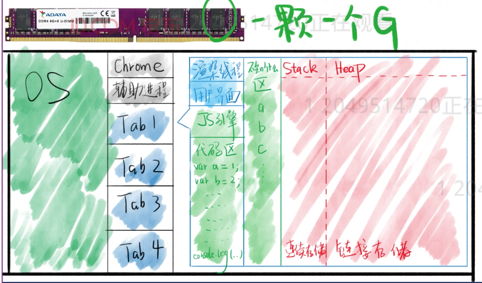
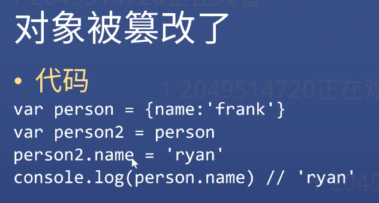
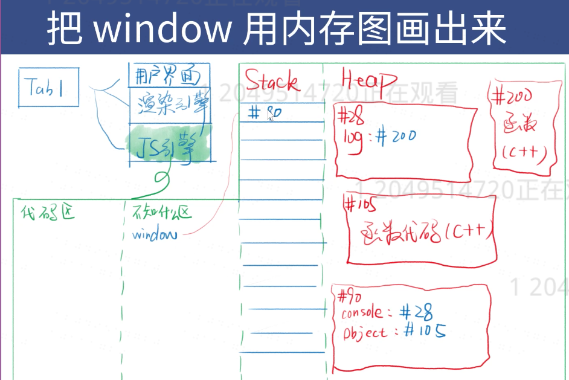
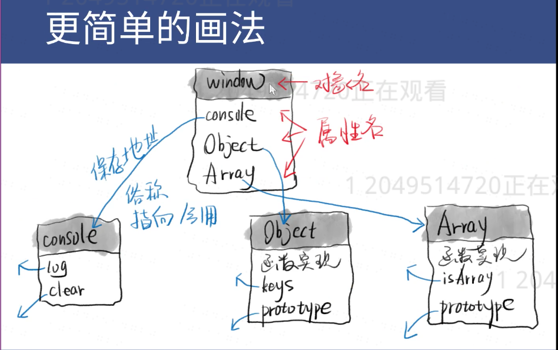
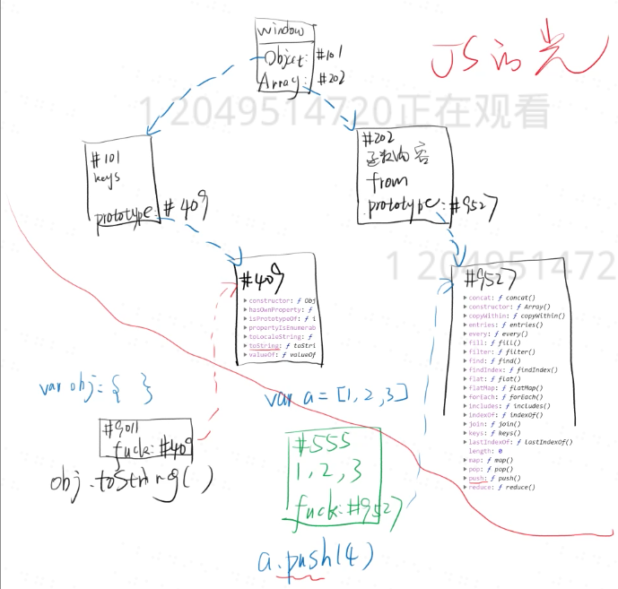

## Execute JS code
- Preparation before execute JS code
  - Ready Work
  - Provide API: ***window/ document/ setTimeout***
  - Above code does not belong to JS itself
  - We call these code as runtime env
  - Once put JS code into the runtime env, it starts to execute JS code

## Where is the JS code running?
- Memory

## Stack and Heap


- Red area divided into Stack and Heap
- The data structure about stack and heap will be talked later
- Stack: Each data stored in order
- Heap: Each data stored randomly
> Rules:
> - There are two data types: Object and non-object
> - Non-Object stores in the Stack
> - Object stores in the Heap
> - '=' operator always copy right content to left
> - Example(When the value has been changed):
>
>    
>    
>    

### When you need to know the structure of a function
 - use ```console.dir(window.Object)```

### What the difference between ***prototype and __proto__***?
- Both of then store the address of the prototype
- However, prototype only exists in functions
- __proto__ exists in every new object

***Important Photo***
>    
