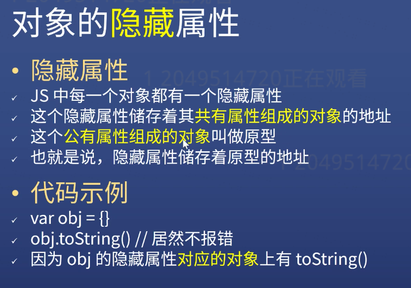
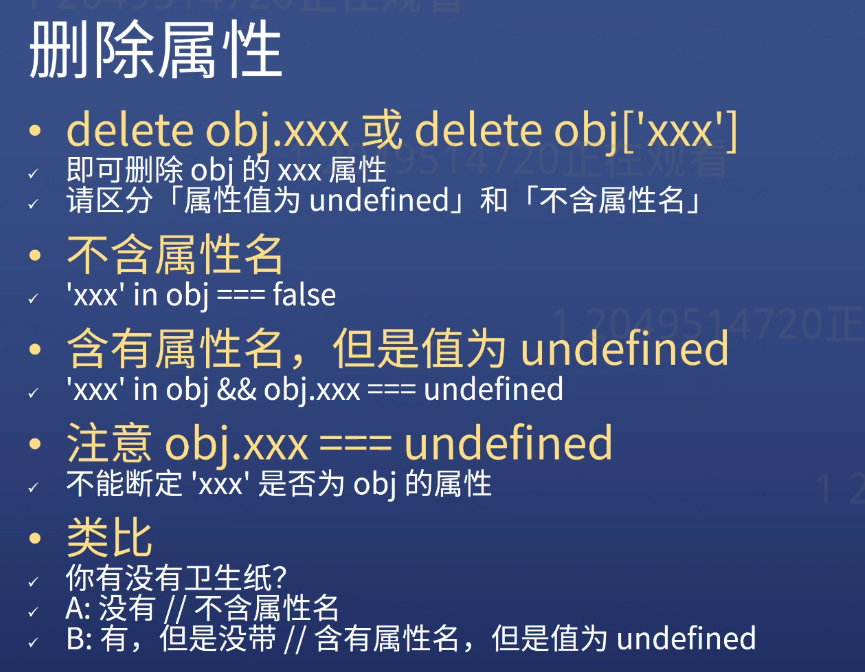
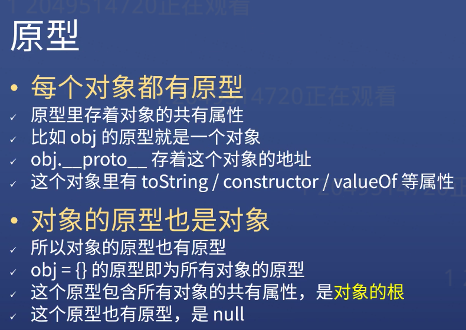
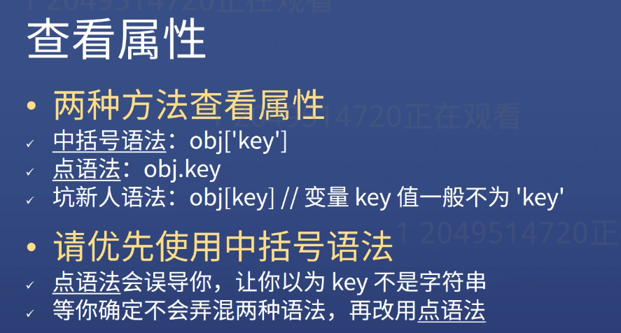
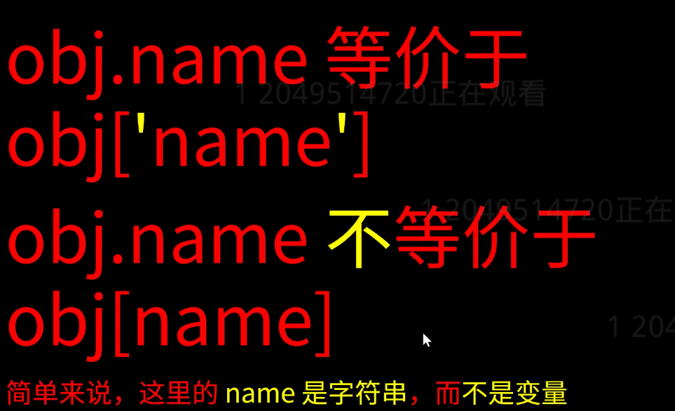
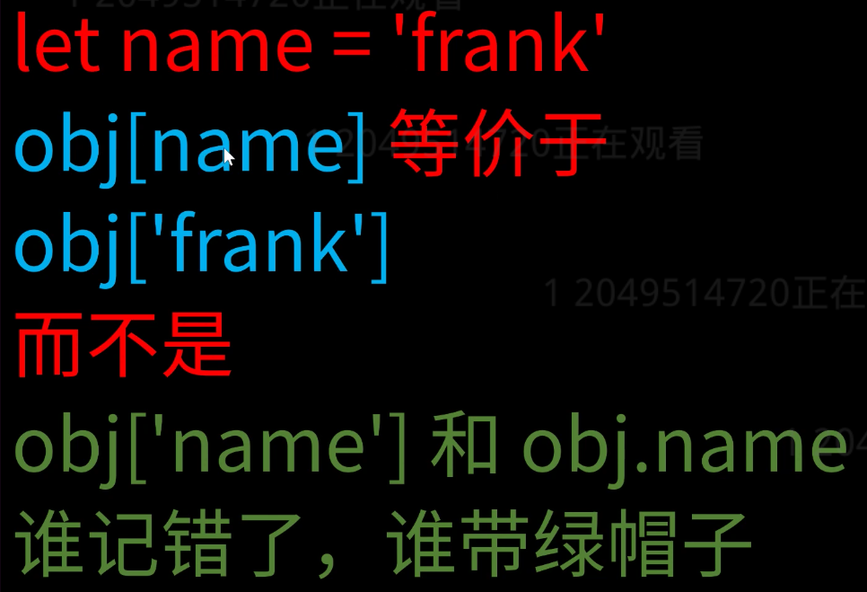

# Object
- #### Definition:
  - Unordered data collection
  - Key-Value Pair collection
 ```javascript
let obj = {'name': 'frank', 'age':18}
let obj = new Object({'name': 'frank'})
console.log({'name':'frank', 'age': 18})
```
- #### Details
  - key name should is string, not identifier, it can include any characters
  - quotation mark can be omitted, after omitting the quotation mark, the key name can only be represented according to the rules of the identifier
  - when you omit the quotation mark, the key name is also string
- Each key is the property name of a object
- Each value is the property value of a object
```javascript
Object.keys(obj)=>["1","100","255","3.2","0.01","0.234"]
Object.keys(obj) // can get all the keys of that obj
```

- #### Variable as Property name
  ```javascript
  let a = 'xxx'
  var obj = {'a': 111}
  var obj = {[a]: 1111} === var obj = {xxx: 1111}
  ```
- **How to use variables as property name?**
  - Previously we use constant as the property name
  - ``` let p1 = 'name' ```
  - ```let obj = {p1: 'frank'} ``` here, the property name is ```'p1'```
  - ```let obj = {[p1]: 'frank'} ``` here, the property name is ```'name'```
- Compare:
  - if there is no [], the property name will automatically become the string
  - if add [], the property will try to find the value inside of the []
  - if the property name is not a string, it will be automatically transformed into a string

- Five Falsy Values
  - null, undefined, 0, NaN, ''
- 7 data types
  - number
  - string
  - bool
  - symbol
  - null
  - undefined
  - object

# The hidden Property in the Object
> 
>


### Delete Property
```javascript
let obj = {name:'frank', age: 18}
obj.name = undefined

console.log(obj)
// result: {name: undefined, age: 18}

delete obj.name
console.log(obj)
// result: {age: 18}

delete obj['name']
// result: true

// check if you have deleted the property successfully or not
// true => property exists, false => property not exists
'name' in obj

name in obj
// result: false
// because name and 'name' are different things,
// we have never declared or defined or assigned any value to name before
// name without ''  is a variable
```
> 

### Read Property
```javascript
let obj = {name:'frank', age: 18}
Object.keys(obj)
//result: (2)["name","age"]
Object.values(obj)
//result: (2)["frank","18"]
Object.entries(obj)
//result:
// (2) [Array(2), Array(2)]
// 0: (2) ["name", "frank"]
// 1: (2) ["age", 18]
// length: 2
// __proto__: Array(0)
```

**When you want to see all the properties in a object, please use  ```Console.dir()```  to print out all the properties.**
```javascript
var obj = {name:'frank', age: 18}
undefined
console.dir(obj)
VM301:1
Object
  age: 18
  name: "frank"
  __proto__:
  constructor: ƒ Object()
  hasOwnProperty: ƒ hasOwnProperty()
  isPrototypeOf: ƒ isPrototypeOf()
  propertyIsEnumerable: ƒ propertyIsEnumerable()
  toLocaleString: ƒ toLocaleString()
  toString: ƒ toString()
  valueOf: ƒ valueOf()
  __defineGetter__: ƒ __defineGetter__()
  __defineSetter__: ƒ __defineSetter__()
  __lookupGetter__: ƒ __lookupGetter__()
  __lookupSetter__: ƒ __lookupSetter__()
  get __proto__: ƒ __proto__()
  set __proto__: ƒ __proto__()
```
> 
```javascript
 obj.hasOwnProperty('toString')  //result: false
  obj.hasOwnProperty('name')  //result: true
 ```

### More Explanation about Prototype
> 
> 
> 
> 
>
