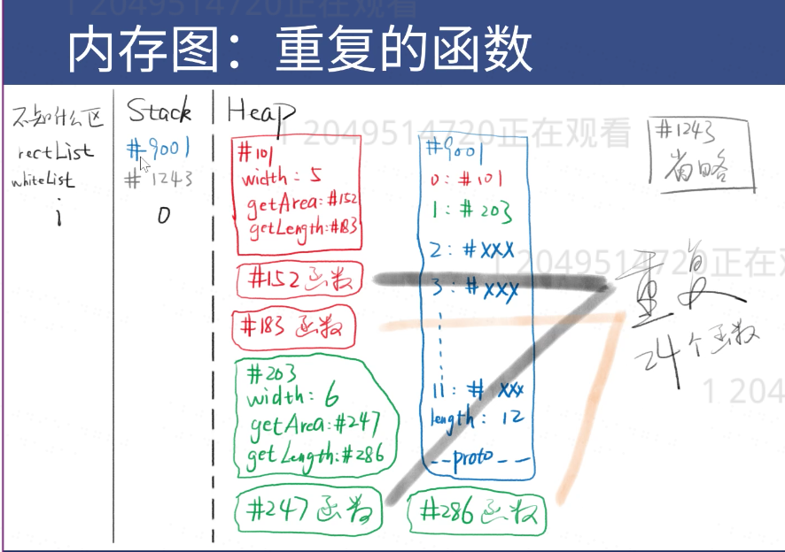
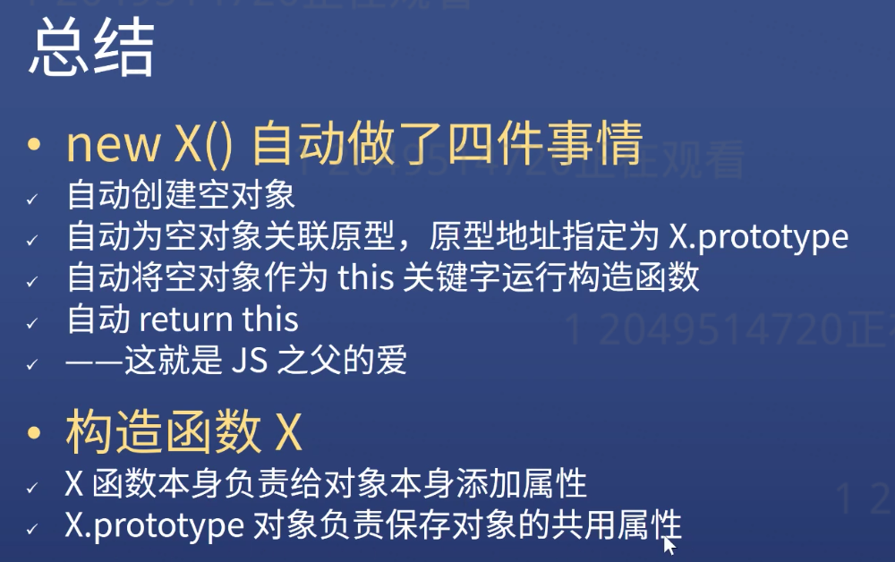
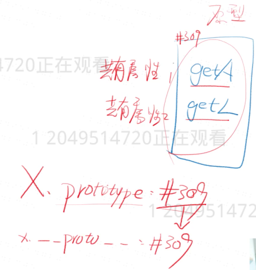
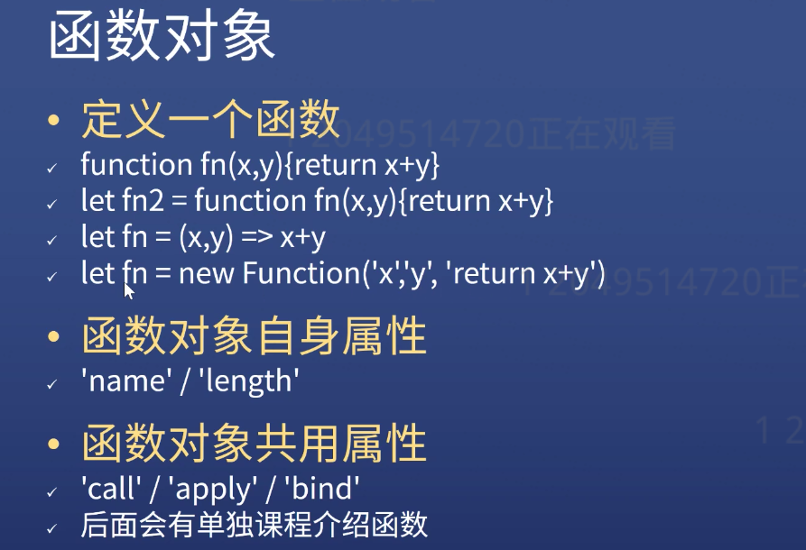
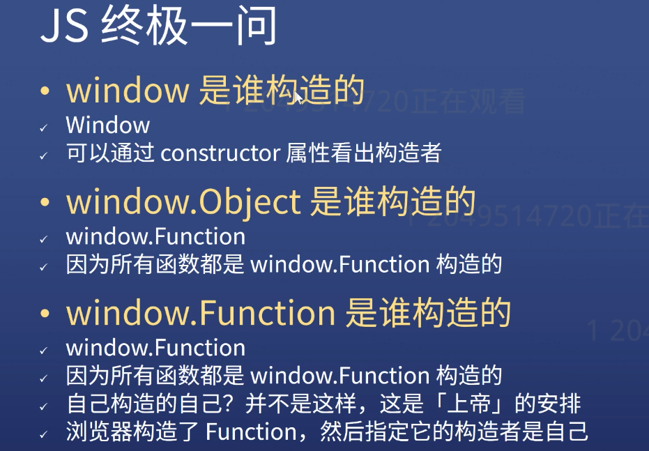

# Does Object needs to be classified?
```javascript
let square = {
  width: 5,
  getArea(){
    return this.width * this.width
  },
  getLength(){
    return this.width * 4
  }
}
```

**You will know much better than other people if you are good at draw the memory diagram.**




- ### Version 1
  ```javascript
  let squareList = []
  let widthList = [5,6,5,6,5,6,5,6,5,6,5,6]
  let squarePrototype = {
    getArea(){
      return this.width * this.width
    },
    getLength(){
      return this.width * 4
    }
  }

  for(let i = 0; i < 12; i++){
    squareList[i] = Object.create(squarePrototype)
    squareList[i].width = widthList[i]
  }
  ```
  > But these code are too spread.

- ### Version 2
  ```javascript
  let squareList = []
  let widthList = [5,6,5,6,5,6,5,6,5,6,5,6]

  let squarePrototype = {
    getArea(){
      return this.width * this.width
    },
    getLength(){
      return this.width * 4
    }
  }
  function createSquare(width){ // this is a construct function
    let ojb = Object.create(squarePrototype)
    obj.width = width
    return obj
  }

  for(let i = 0; i < 12; i++){
    squareList[i] = createSquare(widthList[i])
  }
  ```
- ### Version 3
  ```javascript
  let squareList = []
  let widthList = [5,6,5,6,5,6,5,6,5,6,5,6]

  function createSquare(width){
    let obj = Object.create(createSquare.squarePrototype)
  }

  // Function also is a Object
  // create a new property named 'squarePrototype' for the function 'createSquare'
  createSquare.squarePrototype = {
    getArea(){
      return this.width * this.width
    },
    getLength(){
      return this.width * 4
    },
    constructor: createSquare
    //you can find the construct function through the 'squarePrototype' prototype
  }
  for(let i = 0; i < 12; i++){
    squareList[i] = createSquare(widthList[i])
  }
  console.log(squareList[i].constructor)
  ```
- ### Version 4 => Combine Function and Prototype
  ```javascript
  let squareList = []
  let widthList = [5,6,5,6,5,6,5,6,5,6,5,6]

  // function name should be capitalized
  function Square(width){
    this.width = width
  }

  Square.prototype.getArea = function(){
    return this.width * this.width
  }
   Square.prototype.getLength = function(){
    return this.width * 4
  }
  for(let i = 0; i < 12; i++){
    squareList[i] = new Square(widthList[i])
    console.log(squareList[i].constructor)
  }
  ```



- **Example**
```javascript
  function Dog(name){
    this.name = name
    this.color = 'white'
    this.kind = 'abs'
  }

  Dog.prototype.bark = function(){console.log('barking')}
  Dog.prototype.run = function(){console.log('running')}
  let dog1 = new Dog('little w')
  Dog {name: "little w", color: "white", kind: "abs"}

  let dog1 = new Dog('little w')
  dog1.run() // result: running
  dog1.bark() // result: barking
```

# Prototype Formula
```javascript
  let obj = new Square()
  obj.__proto__ === Square.prototype
  对象.__proto__ === 其构造函数.prototype
  // 你是谁的构造的  你的原型就是谁的prototype属性对应的对象
```


### Object need to be classified
```javascript
function Circle(radius){
    this.radius = radius
}
Circle.prototype.getLength = function(){
    return this.radius * 2 * Math.PI
}
Circle.prototype.getArea = function(){
    return Math.pow(this.radius, 2) * Math.PI
}
let c1 = new Circle(10)
c1.radius //result: 10
c1.getLength() // result: 62.83185307179586
c1.getArea() // result: 314.1592653589793
```

### Function Object



