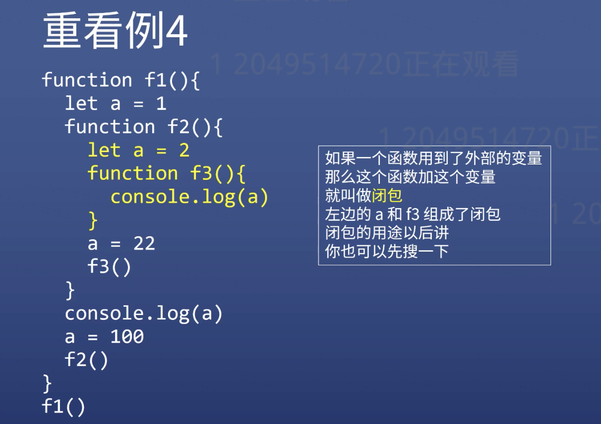
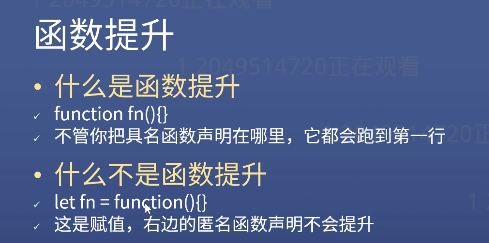
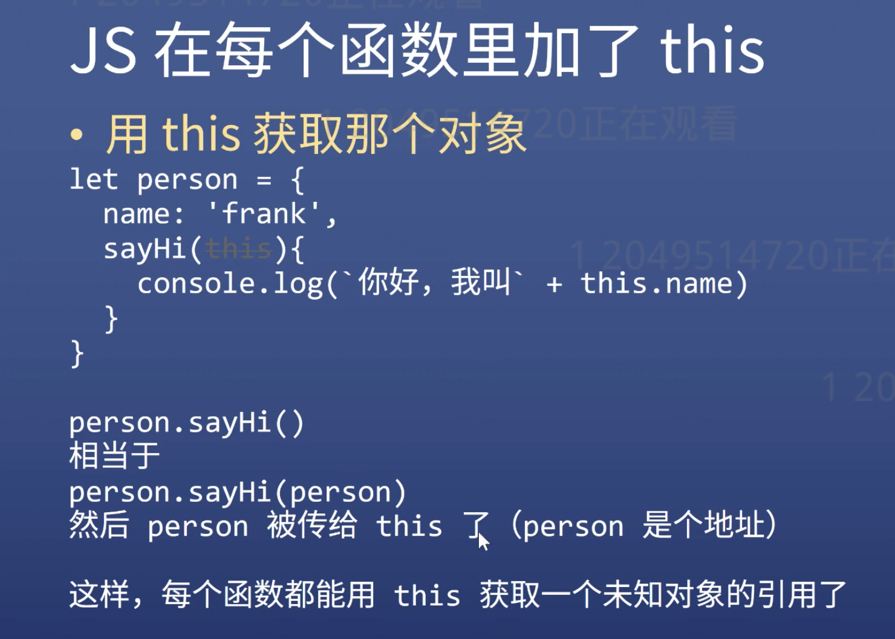

- Call time
- Scope
- Closure
- Parameter
- Return value
- Call Stack
- Hoisting
- Arguments (except arrow function)
- This







```javascript
function fn(){
  console.log(this)
}

// if you don't give any condition to the function, 'this' will point to the 'window'
```
### if you don't give any condition to the function, 'this' will point to the 'window'

## We must use:
```javascript
let person = {name:'frank',
sayHi(){
  console.log(this.name)
  }
}
person.sayHi.call(person)
```


```javascript
function add(x, y){
  return x + y
}

add.call(undefined, 1,2)
// first value used to occupy the position
```
