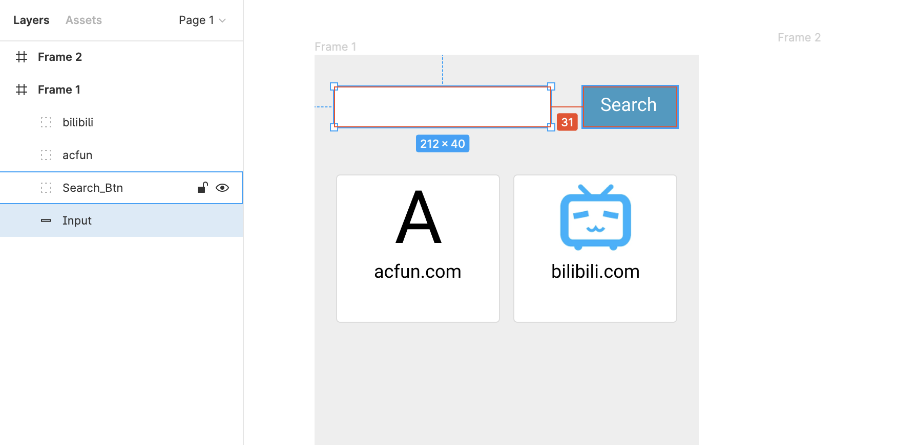

### Figma Tips
- Copy a Rectangle: Mac press ```option``` , Win press ```Alt```,then drag the original rectangle to the target place
- White: ```#ffffff```
- Black: ```#000000```
- Grey: ```#EEEEEE```
- Border Color: ```dddddd```
- Adjust the size of image without deformation: Press ```shift``` to drag image
- Check space or pixel between 2 rectangles:
  - Select one rectangle, press ```option```, hover to another rectangle, you will see the pixel between them
  - 


### CSS Tips
#### Body Border and Background
```css
    body{border: 1px solid red;}
    /* when you give a border to the body, it only shows the border of the content area.
    If the content area is very small, the border area is also small.

    But when you give the background color to a body, the background color will spread out over the entire webpage.*/

    body{
      background:#eeeeee;
    }
```
#### CSS Reset Code
```CSS
    *{box-sizing: border-box;}
    *:before, *:after{box-sizing:border-box;}
    *{margin:0; padding:0;}
    ul, ol { list-style: none;}
```


