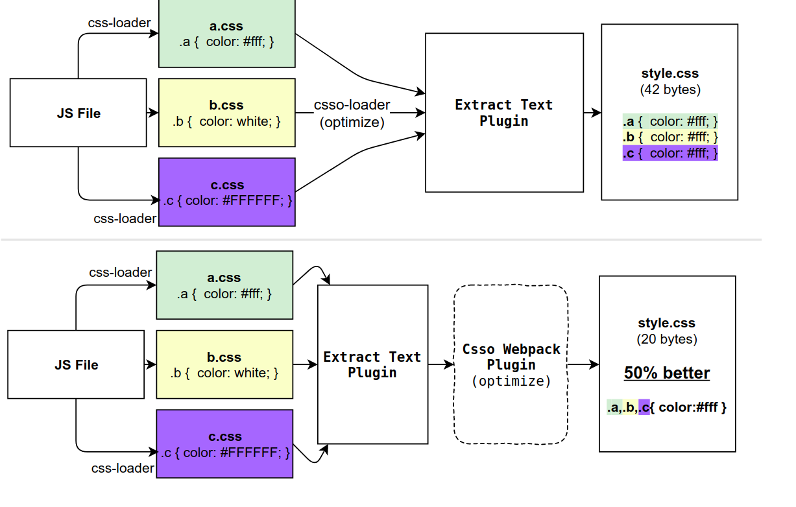

Source: [Loader and plugin!](https://stackoverflow.com/questions/37452402/webpack-loaders-vs-plugins-whats-the-difference#:~:text=Loaders%20work%20at%20the%20individual,the%20bundles%20themselves%20are%20created.)

### Loader
Loaders work at the individual file level during or before the bundle is generated.

### Plugins:
Plugins work at bundle or chunk level and usually work at the end of the bundler generation process. Plugins can also modify how the bundles themselves are created. Plugins have more powerful control than loaders.

#### Just for an example you can clearly see in below image where loaders are working and where plugins are working.
