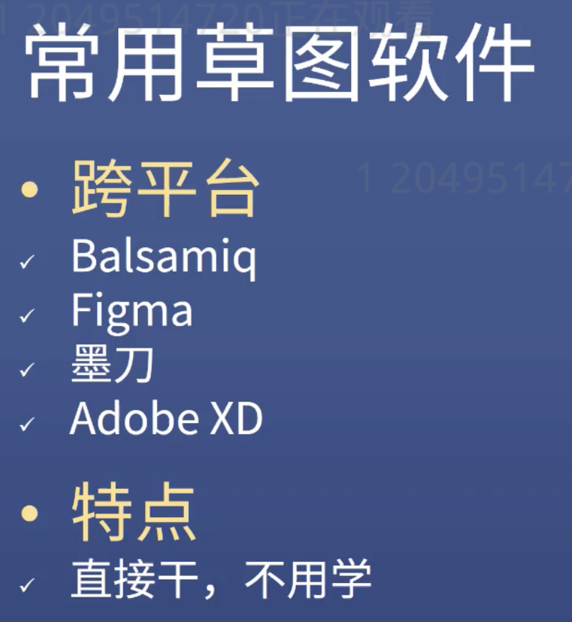
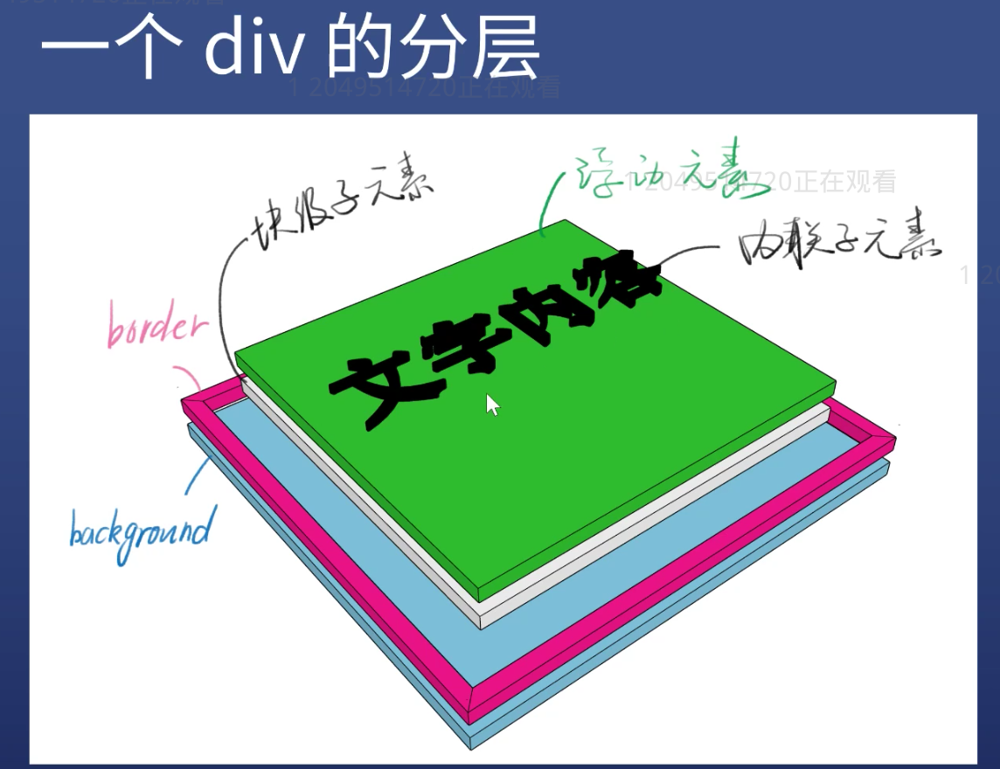

#### ★ You can Try To Find More Practice Materials Online~~~ For Example: Flexbox Froggy
## Layout
1. The fixed width: the width always is 960/ 1000 / 1024 px
2. Not Fixed Width: mainly depends on normal flow layout
   *  The Normal Flow is automatically fitted, no more extra style
3. Responsive Layout
     * Which means the width fix in the PC, but not fix in the mobile phone
     * In other words, mixed layout


#### Float
* Add  ***float:left*** and ***width*** in the children elements
* Add ***.clearfix*** in the parent element

#### Important To Remember - Flex
* display:flex;
* flex-direction:row/column
* flex-wrap: wrap
* just-content:center / space-between
* align-items:center
* (These are basic use in work environment)

#### Regular sketch tools



##  **Grid**
* Shortcut to create multiple classes
```html
.a+.b+.c+.d  -> press tab
```

### One picture shows the div layout



### z-index
   The z-index CSS property of a positioned element and its descendants or flex items. Overlapping elements with a larger z-index cover those with a smaller one.

   For a positioned box(that is, one with any position other than static), the z-index property specifies:
   1. The stack level of the box in the current stacking context.
   2. z-index in the current stacking context level has no interaction with other stack level.
   3. z-index in the same stack level can be compared.
   4. [Stacking Content Reference](https://developer.mozilla.org/en-US/docs/Web/CSS/CSS_Positioning/Understanding_z_index/The_stacking_context)

#### Shortcut to call 'Console'
* In any tab, press  ESC

### The Process of the Browser Rendering
***Step:***
1. According to the HTML to construct the HTML Tree(DOM)
2. According to the CSS construct the CSS Tree
3. Merge two trees into one Rendering Tree
4. Layout (Normal Flow, Box Model, Calculate Size and Position)
5. Painting (Draw out the border color, font color, shadow)
6. Finally compose all the parts together


### Rendering Performance (Cramming)
1. Optimizing Javascript Execution
    - Avoid setTimeout or ***setInterval*** for visual updates; always use ***requestAnimationFrame*** instead.
    - Move long-running Javascript off the main thread to Web Workers.
    - Use micro-tasks to make DOM changes over several frames.
    - Use Chrome DevTools' Timeline and Javascript Profiler to assess the impact of Javascript.
2. Reduce the Scope and Complexity of Style Calculations
    - Reduce the complexity of your selectors; use a class-centric methodology like BEM.
    - Reduce the number of elements on which style calculation must be calculated.
3. Avoid Large, Complex Layouts and Layout Thrashing
    - Similarly to style calculations, the immediate concerns for layout cost are:
      - The number of elements that require layout.
      - The complexity of those layouts.
    - Layout is normally scoped to the whole document.
    - The number of DOM elements will affect performance; you should avoid triggering layout wherever possible.
    - Assess layout model performance; new Flexbox is typically faster than older Flexbox or float-based layout models.
    - Avoid forced synchronous layouts and layout thrashing; read style values then make style changes.
4. Simplify Paint Complexity and Reduce Paint Areas
    - Changing any property apart from transforms or opacity always triggers paint.
    - Paint is often the most expensive part of the pixel pipeline; avoid it where you can.
    - Reduce paint areas through layer promotion and orchestration of animations.
    - Use the Chrome DevTools paint profiler to assess paint complexity and cost; reduce where you can.
5. Stick to Compositor-Only Properties and Manage Layer Count
    - Stick to transform and opacity changes for your animations.
    - Promote moving elements with ***will-change*** or ***translateZ***.
    - Avoid overusing promotion rules; layers require memory and management.
6. Debounce Your Input Handlers
    - Avoid long-running input handlers; they can block scrolling.
    - Do not make style changes in input handlers.
    - Debounce your handlers; store event values and deal with style changes in the next requestAnimationFrame callback.