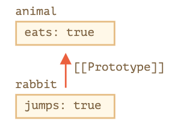
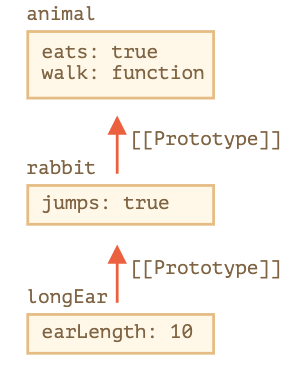

### 1. What is closure?  What is the function of closure?  What is the disadvantage of closure?
> A closure is a feature in Javascript where an inner function has access to the outer (enclosing) function's  variables.
>

- #### Here is the example of function of closure:
```javascript
   let global = 33
   function outside() {
     let a = 10
     let b = 20

     function inside() {
       let c = 30
       return a + b + c + global
     }
     return inside
   }
   // When we call outside()
   let result = outside()()
   console.log(result)  // 93
```
> The above combination is a closure.
> ```inside()``` function is nested in the ```outside()``` function.
>
> All local variables in the ```outside()```  are accessible for ```inside()```.
>
> But local variables in the ```inside()```  are invisible for ```outside()```.
>
> This is the special ```chain scope``` of Javascript.
>
> The Child object will look upward one level at a time for all variables in the parent objects or grandparent objects. All variables of the parent objects are visible to the child objects. The reverse is not applicable.
>
- #### The drawback of closure
> As long as the closure is active, the memory can't be garbage collected.
>
> Example: If we have 100 different functions referencing the original variable, and 99 of them get garbage collected, that variable still exists until the 100th functions  completed and gets collected.
> Closure may lead to over-consumption of memory, and probably memory leaks if not handled properly.
- #### How to fix that?
> Use closures only when you need privacy otherwise use module pattern to create new objects with methods inside.


### 2. How to use ```call, apply, bind``` ?
- ####  The ```call()``` method calls a function with a given this value and arguments provided individually.
```javascript
  // example #1
  let person = {
    name: 'Harry Porter',
    sayHi: function(param){
      console.log(this.name + " say hello to " + param);
    }
  }

  person.sayHi("Lady Gaga")  // output: Harry Porter say hello to Lady Gaga
  let otherName = {name: "Princess Helen."}
  person.sayHi.call(otherName, "Tom Ford") // output: Princess Helen. say hello to Tom Ford
  person.sayHi.call({name: "Happy Sunday"}, "Lander Wood")

  // example #2
  let someone = {
    fullName: function(){
      return this.firstName + " " + this.lastName
    }
  }

  let p1 = {
    firstName:"John",
    lastName: "Doe"
  }
  let p2 = {
    firstName:"Mary",
    lastName: "Doe"
  }

  console.log(someone.fullName.call(p1)) // output: "John Doe"
  console.log(someone.fullName.call(p2)) // output: "Mary Doe"
```
- #### ```apply()``` is similar to ```call()``` except that it takes an array-like object instead of listing the arguments out one at a time.
- #### The ```call()``` method takes arguments separately.
- #### The ```apply()``` method takes arguments as an array.
```javascript
  let collectionInfo = {
    fullName: function(city, country){
      return this.firstName + " " + this.lastName +  " comes from " + " " + city + ", " + country;
    }
  }

   let p1 = {
    firstName:"John",
    lastName: "Doe"
  }

  console.log(collectionInfo.fullName.apply(p1, ["Boston", "America"]));
  // output: John Doe comes from  Boston, America
```
- #### ```bind()``` returns a new function, allowing you to pass in a this array and any number of arguments
```javascript
  let heavenSome = {
    myCar(carMode, carColor, carYear){
     return `My name is ${this.firstName} ${this.lastName}, I have a car, it's ${carMode}, the color is ${carColor} and it is made in ${carYear}`
    }
  }

  let thisIsMyCar = heavenSome.myCar.bind(p1, "Toyota", "Silver", "2020")
  // return a function [Function: bound myCar]
  console.log(thisIsMyCar());
  // output: My name is John Doe, I have a car, it's Toyota, the color is Silver and it is made in 2020
```


### 3. Please describe more information about HTTP status code, at least 10
1. #### Success 2XX
> This class of status codes indicates the action requested by the client was received, understood, and accepted.
2. #### OK 200
> Standard response for successful HTTP requests. The actual response will depend on the request method used. In a GET request, the response will contain an entity corresponding to the requested resource. In a POST request, the response will contain an entity describing or containing the result of the action.
3. #### Created 201
> The request has been fulfilled, resulting in the creation of a new resource.
4. #### Accepted 202
> The request has been accepted for processing, but the processing has not been completed. The request might or might not be eventually acted upon, and may be disallowed when processing occurs.
5. #### Non-Authoritative Information 203
> The server is a transforming proxy (e.g. a Web accelerator) that received a 200 OK from its origin, but is returning a modified version of the origin's response.
6. #### No Content 204
>The server successfully processed the request, and is not returning any content.
7. #### Error 4xx
> This class of status code is intended for situations in which the error seems to have been caused by the client.
8. #### Bad Request 400
> The server cannot or will not process the request due to an apparent client error (e.g., malformed request syntax, size too large, invalid request message framing, or deceptive request routing)
9. #### Unauthorized 401
> Similar to 403 Forbidden, but specifically for use when authentication is required and has failed or has not yet been provided.
10. #### Forbidden 403
> The server, but the server is refusing action. This may be due to the user not having the necessary permissions for a resource or needing an account of some sort, or attempting a prohibited action
11. #### Not Found 404
> The requested resource could not be found but may be available in the future. Subsequent requests by the client are permissible.
12.  #### Error 5xx
> The server failed to fulfill a request.
13. #### Internal Error 500
> A generic error message, given when an unexpected condition was encountered and no more specific message is suitable.
14.  #### Not Implemented 501
> The server either does not recognize the request method, or it lacks the ability to fulfil the request.
15.  #### Bad Gateway 502
> The server was acting as a gateway or proxy and received an invalid response from the upstream server.
16. #### Service Unavailable 503
> The server cannot handle the request (because it is overloaded or down for maintenance). Generally, this is a temporary state.


### 4. Remove duplicate elements from array in Javascript
#### Classic interview questions
> Here is an array ```let array = [1,5,2,3,4,2,3,1,3,4]```, please write a function ```unique(array)```, the final result is ```[1,5,2,3,4]```, remove the duplicate values.
>
> Requirement:
> - One way don't use ```Set``` (6 points)
```javascript
  let array = [1, 5, 2, 3, 4, 2, 3, 1, 3, 4]
  function unique(arr) {
    return arr.filter((element, index) => {
      console.log(element + "===" + arr.indexOf(element) + "===" + index);
      // 1===0===0
      // 5===1===1
      // 2===2===2
      // 3===3===3
      // 4===4===4
      // 2===2===5
      // 3===3===6
      // 1===0===7
      // 3===3===8
      // 4===4===9
      return arr.indexOf(element) === index
    })
  }
  console.log(unique(array).sort());
  // output:[ 1, 2, 3, 4, 5 ]
  console.log(array.indexOf(3));
  // output: 3
```
> - Another way use ```Set``` (4 points)
```javascript
  let array = [1, 5, 2, 3, 4, 2, 3, 1, 3, 4]
  function unique(obj){
    return [...new Set(obj)]
  }
  console.log(unique(array).sort());
  // output:[ 1, 2, 3, 4, 5 ]
```
> - Use ```Map/WeakMap``` to remove duplicate values. (Extra 5 points)

```javascript
let array = [1, 5, 2, 3, 4, 2, 3, 1, 3, 4]
function unique(arr){
  let hashMap = new Map()
  let result = new Array() // collect the result the returned by parameter arr

  for(let i = 0; i < arr.length; i++){
     if(hashMap.has(arr[i])){ // check if it has been existed a key in the hashMap
     hashMap.set(arr[i], true) // "true" means key is existed in the hasMap
     }else{
       hashMap.set(arr[i], false)
       result.push(arr[i]) // if there no the same key in the hashMap, add to the result
  }
  return result
}
console.log(unique(array).sort()); // result: [ 1, 2, 3, 4, 5 ]
```
> Explain the cons of each method (Extra 2 Points)


### DOM Event
> 1. What is Event Delegation (4 points)
>
>DOM event delegation is a  mechanism of responding to ui-events via a single common parent rather than each child, through the magic of event "bubbling".
>
> Event bubbling provides the foundation for event delegation in browsers. Now you can bind an event handler to a single parent element, and that handler will get executed whenever the event occurs on any of its child nodes(and any of their children in turn)  ```This is event delegation```. Here is an example of it in practice.
>
```html
    <ul onclick="alert(event.type + '!')">
        <li>One</li>
        <li>Two</li>
        <li>Three</li>
    </ul>
```
> With that example if you were to click on any of the child ```<li>``` nodes, you would see an alert of ```"click"```, even though there is no click handler bound to the ```<li>```  you clicked on. If we bound ```onclick="..."``` to each ```<li>``` you would get the same effect.

> 2. How to prevent default Action (3 points)
>
> The ```preventDefault()``` method cancels the event if it is cancelable, meaning that the default, action that belongs to the event will not occur.
>
```html
<button id="demo">Click Me</button>
```
```javascript
  document.getElementById("demo").addEventListener('click', (e)=>{
    e.preventDefault()
  })
```
>
> 3. How to prevent bubbling? (3 points)
>
> The ```stopPropagation``` method of the ```Event``` interface prevents further propagation of the current event in the capturing and bubbling phases. It does not prevent any default behaviors from occurring; for example, clicks on links are still processed. If you want to stop those behaviors, see the ```preventDefault()```.
```javascript
 e.stopPropagation()
```

### How to explain the ```inheritance``` of Javascript?
1. #### Inheritance based on Prototype? (5 points)
> In programming, we often want to take something and extend it.
>
> For instance, we have a ```user``` object with its properties and methods, and want to make ```admin``` and ```guest``` as slightly modified variants of it. We'd like to reuse what we have in ```user```, not copy or re-implement its methods, just build a new object on top of it.
>
> Prototypal inheritance is a language feature that helps in that.
> ### [[Prototype]]
> In Javascript, objects have a special hidden property ```[[Prototype]]``` (as named in the specification), that is either ```null``` or references another object. That object is called "a prototype".
>
> When we read a property  from ```object```, and it's missing, Javascript automatically takes it from the prototype. In programming, such thing is called "prototypal inheritance". And soon we'll study many examples of such inheritance, as well as cooler language features built upon it.
>
> The property ```[[Prototype]]``` is internal and hidden, but there are many ways to set it.
> >
> One of them is to use the special name ```__proto```, like this:
```javascript
  let animal = {
    eats: true
  }
  let rabbit = {
    jumps: true
  }
  rabbit.__proto__ = animal; // (*) set rabbit.[[Prototype]] = animal
```

> Now if we read a property from ```rabbit```, and it's missing, Javascript will automatically take it from ```animal```.
```javascript
// we can find both properties in rabbit now
alert(rabbits.eats) // true (**)
alert(rabbits.jumps)// true
```

> Here the line(*) sets ```animal``` to be a prototype of ```rabbit```
> >
> Then, when ```alert``` tries to read property ```rabbit.eats(**)```, it's not in ```rabbit```, so Javascript follows the ```[[Prototype]]``` reference and finds it in ```animal``` (look from the bottom up):
>


> Here We can say that "animal" is the prototype of "rabbit" or "rabbit" prototypically inherits from "animal".
> >
> So if ```animal``` has a lot of useful properties and methods, then they become automatically available in ```rabbit```. Such properties are called ```inherited```:
>
> If we have a method in ```animal```, it can be called on ```rabbit```:
```javascript
    let animal = {
      eats: true,
      walk(){
        alert("Animal walk")
      }
    }
    let rabbit = {
      jumps: true,
      __proto__: animal
    }
    // walk is taken from the prototype
    rabbit.walk() // Animal walk
```
> The prototype chain can be longer:
```javascript
    let animal = {
      eats: true,
      walk() {
        alert("Animal walk");
      }
    };
    let rabbit = {
      jumps: true,
      __proto__: animal
    };
    let longEar = {
      earLength: 10,
      __proto__: rabbit
    };
    // walk is taken from the prototype chain
    longEar.walk(); // Animal walk
    alert(longEar.jumps); // true (from rabbit)
```


> Now if we read something from ```longEar```, and it's missing, Javascript will look for it in ```rabbit```, and then in ```animal```.

> There are only two limitations:
> 1. The references can't go in circles. Javascript will throw an error if we try to assign ```__proto__``` in a circle.
> 2. The value of ```__proto__``` can be either an object or ```null```. Other types are ignored.
> >
> Also it may be obvious, but still: there can be only one [[Prototype]]. An object may not inherit from two others.

> ```__proto__``` is a historical ```getter / setter``` for ```[[Prototype]]```
> It is a common mistake of novice developers not to know the difference between these two.
> Please not that ```__proto__``` is not the same as the internal ```[[Prototype]]``` property. It's a getter/setter for ```[[Prototype]]```.
> >
> The ```__proto__``` property is a bit outdated. It exists for historical reasons, modern Javascript suggests that we should use ```Object.getPrototypeOf / Object.setPrototypeOf``` functions instead that get/set the prototype. We'll also cover these functions later.
> >
> By the specification, ```__proto__``` must only be supported by browsers. In fact through, all environments including server-side support ```__proto__```, so we're quite safe using it.
> >
> As the ```__proto__``` notation is a bit more intuitively obvious, we use it in the example.
2. #### Inheritance based on class? (5 points)
#### Class Inheritance of ES5
```javascript
  // ES5
  function Animal (name, energy){
    this.name = name
    this.energy = energy
  }
  Animal.prototype.eat = function(amount){
    console.log(`${this.name} is eating.`)
    this.energy += amount
  }
  Animal.prototype.sleep = function(length){
    console.log(`${this.name} is sleeping.`)
    this.energy  += length
  }
  Animal.prototype.play = function(length){
    console.log(`${this.name} is playing.`)
    this.energy -= length
  }
  const leo = new Animal('Leo', 7)
  //In ES5, refactor a Dog class by inheriting the Animal Class
  function Dog(name, energy, breed){
    Animal.call(this, name, energy)
    this.breed = breed
  }
  Dog.prototype = Object.create(Animal.prototype)
  Dog.prototype.bark = function(){
    console.log('Woof Woof!')
    this.energy -= .1
  }
  Dog.prototype.constructor = Dog
```
#### Class Inheritance of ES6
```javascript
    //ES6
    class Animal{
      constructor(name, energy){
        this.name = name
        this.energy = energy
      }
      eat(amount){
        console.log(`${this.name} is eating.`)
        this.energy += amount
      }
      sleep(length){
        console.log(`${this.name} is sleeping.`)
        this.energy += length
      }
      play(length){
        console.log(`${this.name} is playing.`)
        this.energy -= length
      }
    }

    const leo = new Animal('Leo', 7)

    // IE6, refactor a Dog class by inheriting from the Animal Class
    class Dog extends Animal{
      constructor(name, energy, breed){
        super(name, energy)
        this.breed = breed
      }
      bark(){
        console.log('Woof Woof!')
        this.energy -= .1
      }
    }
```

### 7. Sort() function
> Here is an array = [2,1,5,3,8,4,9,5]. please create an methods, sort the array in an ascending order
> this sort(array)  function will get the result of an array [1,2,3,4,5,5,8,9], you can modify the original array or create a new variable to store the sorted array. Don't use the In-Build JS sort API
```javascript
  //Counting Sort
  let countSort = (arr) => {
    let hashTable = {}, max = 0, result = []
    for(let i = 0; i < arr.length; i++){  //traverse array
       if(!(arr[i] in hashTable)){
         hashTable[arr[i]] = 1
       }
       else
       {
         hashTable[arr[i]] += 1
       }

       if(arr[i] > max){
         max = arr[i]
       }
    }

    for(let j = 0; j <= max; j++){
      if(j in hashTable){
        for(let i = 0; i < hashTable[j]; j++){
          result.push(j)
        }
      }
    }
    return result
  }

  let array5 = [2,1,5,3,8,4,9,5]
  console.log("Count Sort=========");
  console.log(countSort(array5));
  // [ 1, 2, 3, 4, 5, 8, 9]
```


### 8 Explain What is Promise？
- #### What is Promise used for?
> Description of Promise
>
> A "producing code" that does something and takes time. For instance, some code that loads the data over a network.
> A "consuming code" that wants the result of the "producing code once it's ready. Many functions may need that result.
> A promise is special Javascript object that links the "producing code" and the "consuming code" together. In terms of our analogy: this is the "subscription list". The "producing code" takes whatever time it needs to produce the promised result, and the "promise" makes that result available to all of the subscribed code when it's ready.
>
- #### How to build a ```new Promise```
```javascript
  let promise = new Promise(function(resolve, reject){
    // executor (the producing code)
  })
```
> The function passed to ```new Promise``` is called executor. When ```new Promise``` is created, the executor runs automatically, It contains the ```producing code``` which should eventually produce the result.
>
> Its arguments ```resolve``` and ```reject``` are callbacks provided by Javascript itself. Our code is only inside the executor.
>
> When the executor obtains the result, be it soon or late, doesn't matter, it should call one of these callbacks:
> ```resolve(value)``` - if the job finished successfully, with result ```value```.
> ```reject(error)``` - if an error occurred, ```error()``` is the error object.
> >
> So to summarize: the executor runs automatically and attempts to perform a job. When it is finished with the attempt it calls ```resolve``` if it was not successful or ```reject``` if there was an error.
>
> The ```promise``` object returned by the ```new Promise``` constructor has these internal properties:
>
> - ```state``` - initially ```"pending"```, then changes to either ```"fulfilled"``` when ```resolve``` is called or ```"rejected"``` when ```reject``` is called.

- #### How to use ```Promise.prototype.then()``` ?
> The most important, fundamental one is ```.then```
>
> The syntax is:
```javascript
   promise.then(
     function(result) { /* handle a successful result */ }
     function(error) { /* handle an error */ }
   )
```
> The first argument of ```.then``` is a function that runs when the promise is resolved, and receives the result.
>
> The second argument of ```.then``` is a function thar runs when the promise is rejected, and receives the error.
>
> For instance, here's a reaction to a successfully resolved promise:
```javascript
  let promise = new Promise(function(resolve, reject){
    setTimeout(()=> resolve("done!"), 1000)
  })
  // resolve runs the first function in .then
  promise.then(
    result => alert(result), // shows "done!" after 1 second
    error => alert(error) // doesn't run
  )
```
> The first function was executed.
> And in the case of a rejection, the second one:
```javascript
  let promise = new Promise(function(resolve, reject){
    setTimeout(()=> reject(new Error("Whoops!")), 1000)
  })
  // reject runs the second function in .then
  promise.then(
    result => alert(result), // doesn't run
    error => alert(error) // shows "Error: Woops!" after 1 second
  )
```
> If we're interested only in successful completions, then we can provide only one function argument to ```.then```

```javascript
  let promise = new Promise(resolve => {
    setTimeout(()=> resolve("done!"), 1000)
  })
  promise.then(alert) // shows "done!" after 1 second
```
- #### How to use ```Promise.all``` ?
> The ```Promise.all()``` method takes an iterable of promises as an input, and returns a single ```Promise``` that resolves to an array of the results of the input promises. This returned promise will resolve when all of the input's promises have resolved, or if the input iterable contains no promises. It rejects immediately upon any of the input promises rejecting or non-promises throwing an error, and will reject with this first rejection message / error.

```javascript
  const promise1 = Promise.resolve(3)
  const promise2 = 42
  const promise3 = new Promise((resolve, reject) => {
    setTimeout(resolve, 100 'foo')
  })
  Promise.all([promise1, promise2, promise3]).then((values) => {
    console.log(values)
  })
  //expected output: Array [3, 42, "foo"]
```

- #### How to use ```Promise.race()``` ?
> The ```Promise.race()``` method returns a promise that fulfills or rejects as soon as one of the promises in an iterable fulfills or rejects, with the value or reason from that promise.
```javascript
   const promise1 = new Promise((resolve, reject) =>{
     setTimeout(resolve, 500, "one")
   })
   const promise2 = new Promise((resolve, reject) =>{
     setTimeout(resolve, 100, "two")
   })
   Promise.race([promise1, promise2]).then((value) => {
     console.log(value)
     // both resolve, but promise2 is faster
   })
   // expected output: "two"
```


### 9 Explain Cross-Origin Resource Sharing (CORS)
- #### What is Same-Origin Policy?
> The ```same-origin policy``` is a critical security mechanism that restricts how a document or script loaded from one ```origin``` interact with a resource from another origin. It helps isolate potentially malicious documents, reducing possible attack vectors.
> Definition of an origin
>
> Two URLs have the same origin if the ```protocol```, ```port```(if specified), and ```host``` are the same for both.
>
> You may see this referenced as the "scheme/host/port tuple", or just "tuple". (A "tuple" is a set of items that together comprise a whole - a generic from for double/triple/quadruple/quintuple/etc)
>
> The following table gives examples of origin comparisons with the URL:
>
> http://store.company.com/dir/page.html

|URL |Outcome| Reason|
|:----|:------|:------|
|http://store.company.com/dir2/other.html| Same Origin| Only the path differs|
|http://store.company.com/dir/inner/another.html|Same Origin|Only the path differs|
|https://store.company.com/page.html|Failure| Different protocol|
|http://store.company.com:81/dir/page.html|Failure | Different port(http:// is port 80 by default)|
|http://news.company.com/dir/page.html|Failure| Different host|
|    |        |      |

- #### What is Cross-Origin Resource Sharing? (CORS)
> Cross-Origin Resource Sharing (CORS) is an HTTP-header based mechanism that allows a server to indicate any other origins(domain, protocol, or port) than its own from which a browser should permit loading of resources. CORS also relies on a mechanism by which browsers make a "preflight" request to the server hosting the cross-origin, in order to check that the server will permit the actual request. In that preflight, the browser sends headers that indicate the HTTP method and headers that will be used in the actual request.

- #### JSONP (Code)
> JSONP is a method for sending JSON data without worrying about cross-domain issues.
>
> JSONP does not use the ```XMLHttpRequest``` object.
>
> JSON use the ```<script>``` tag instead.
>
> JSONP stands for JSON with Padding.
>
> Requesting a file from another domain can cause problems, due to cross-domain policy.
>
> Requesting an external script from another domain does not have this problem.
> JSONP uses this advantage, and request files using the script tag instead of the ```XMLHttpRequest``` object.
> >
> Say you're on domain ```example.com```, and you want to make a request to domain ```example.net```. To do so, you need to ```cross domain``` boundaries, a ```no-no``` in most of browserland.
> >
> The one item that bypasses this limitation is ```<script>``` tags. When you use a script tag, the domain limitation is ignored, but under normal circumstance, you can't really do anything with the results, the script just gets evaluated.

> Enter ```JSONP```. When you make your request to a server that is JSONP enabled, you pass a special parameter that tells the server a little bit about your page. That way, the server is able to nicely wrap up its response in a way that your page can handle.
>
> For example, say the server expects a parameter called ```callback``` to enable its JSONP capabilities. Then your request would look like:
```
  http://www.example.net/sample.aspx?callback=mycallback
```
> Without JSONP, this might return some basic Javascript object, like so:
```json
  {foo: 'bar'}
```
> However, with JSONP, when the server receives the "callback" parameter, it wraps up the result a little differently, returning something like this:
```javascript
 mycallback({foo:"bar"})
```
> As you can see, it will now invoke the method you specified. So, in your page, you define the callback function.
```javascript
  mycallback = function(data){
    alert(data.foo);
  }
```
> And now, when the script is loaded, it'll be evaluated, and your function will be executed. Voila, cross-domain requests!
- #### CORS (Code)
> The Cross-Origin Resource Sharing standard works by adding new ```HTTP headers``` that let servers describe which origins are permitted to read that information from a web browser.
>
> ```Access-Control-Allow-Origin``` A returned resource may have one ```Access-Control-Allow-Origin``` header, with the following syntax:
```
  Access-Control-Allow-Origin: <origin> | *
```
> ```Access-Control-Allow-Origin``` specifies either a single origin, which tells browser to allow that origin to access the resource; or else - for requests without credentials - the "*" wildcard, to tell browsers to allow any origin to access the resource.
> For example, to allow code from the origin: ```https://mozilla.org``` to access the resource, you can specify:
```
Access-Control-Allow-Origin: https: // mozilla.orig
Vary: Origin
```
> If the server specifies a single origin (that may dynamically change based on the requesting origin as part of a white-list) rather than the "*" wildcard, then the server should also include ```Origin``` in the ```Vary```  response header - to indicate to clients that server responses will differ based on the value of the ```Origin``` request header.


### 10 Personal Understanding of Front-End
> What is a Front-End Developer? The front-end of a website is the part that users interact with. Everything that you see when you're navigating around the internet, from fonts and colors to dropdown menus and sliders, is a combo of HTML, CSS and Javascript being controlled by your computer's browser.

> Front-end developers are responsible for a website's user-facing code and the architecture of its immersive user experiences. In order to execute those objectives, front-end devs must be adept at three main languages: HTML, CSS and Javascript programming. In addition to fluency in these language, front-end need to be familiar with frameworks like Bootstraps, Foundation, Backbone, AngularJS and EmberJS, which ensure great-looking content no matter the device, and libraries like jQuery and LESS, which package code into a more useful, time-saving form. A lot of front-end developer job listings also call for experience with Ajax, a widely used technique for using JS that lets pages dynamically load by downloading server data in the background.

> Everything you’re seeing on this website right now was made possible by a front-end developer. A designer crafted the logo and graphics, a photographer took the pictures, and a copywriter wrote the text. But a front-end dev assembled all of those pieces, translated them into web-speak, and built the experience you have with each page. To take one specific example, scroll up and down on the Udacity homepage. Notice how the “U” disappears and reappears? That’s the handiwork of a front-end developer.


